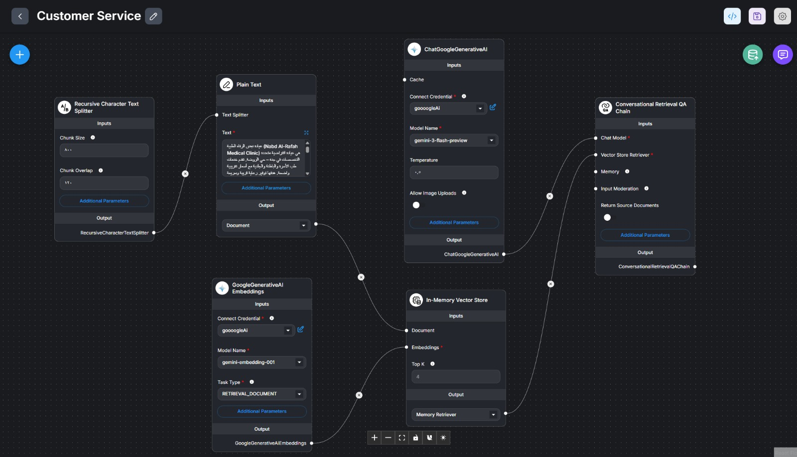

# flowise-project
CCSW 325 - Flowise (Category C) LLM orchestration project + replication package

 Solution Overview: 
 Implementation Walkthrough: 

 How to Run (Flowise Cloud)
1.	Log in to Flowise Cloud and open the Chatflow  ,press add new then load the the chatflow file .
2.	Go to Credentials and add/select your GoogleAI (Gemini) API Key.
3.	Ensure the credential is selected in both nodes: ChatGoogleGenerativeAI and GoogleGenerativeAI Embeddings.
4.	Verify key settings: Text Splitter (Chunk Size 800, Overlap 120), Embeddings model gemini-embedding-001 with RETRIEVAL_DOCUMENT, and Vector Store Top K = 4.
5.	Click Save, then open Chat Preview/Test Chat.
6.	Ask a question (e.g., “What is the WhatsApp number?”) and confirm the bot responds using the stored clinic information.
    Demo : 
